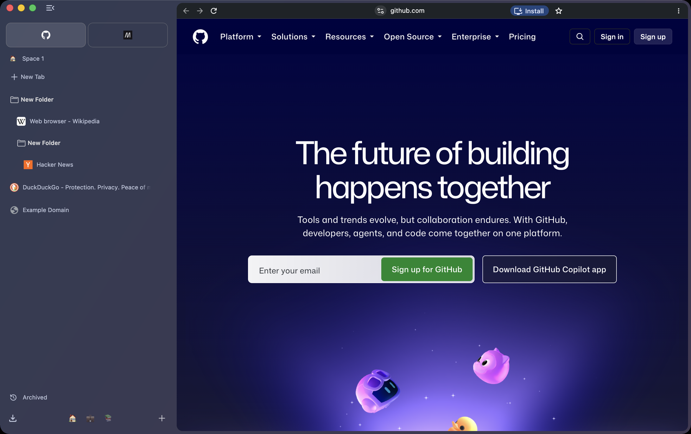
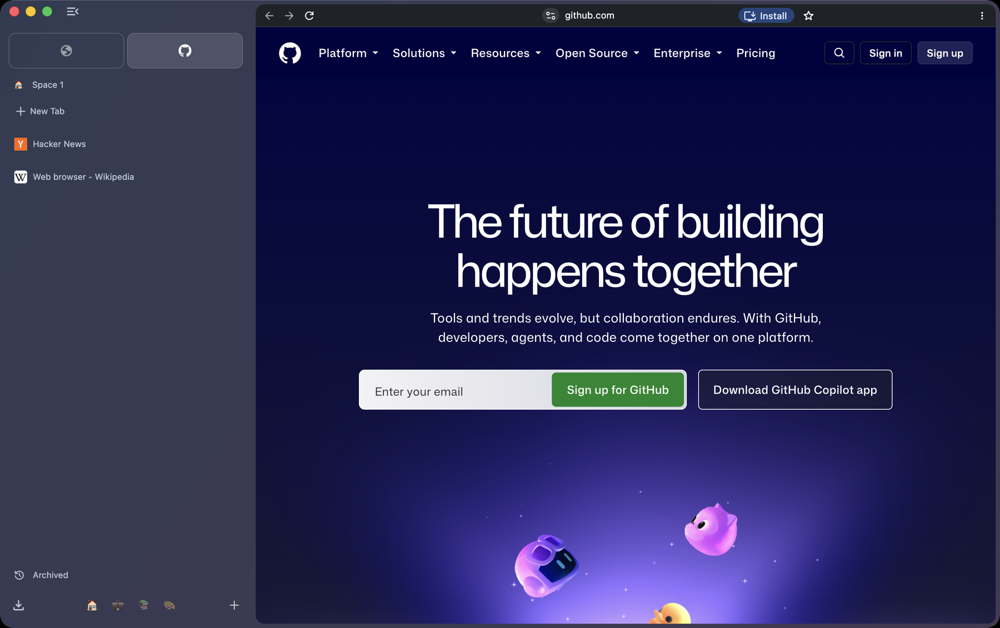
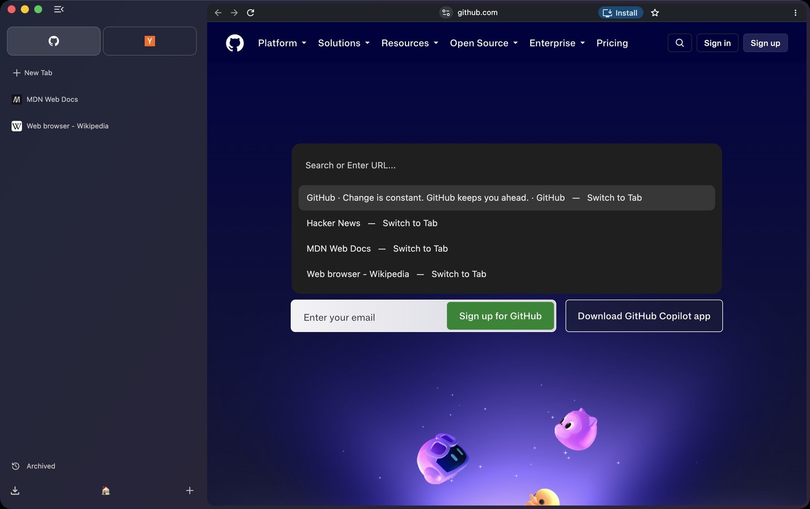
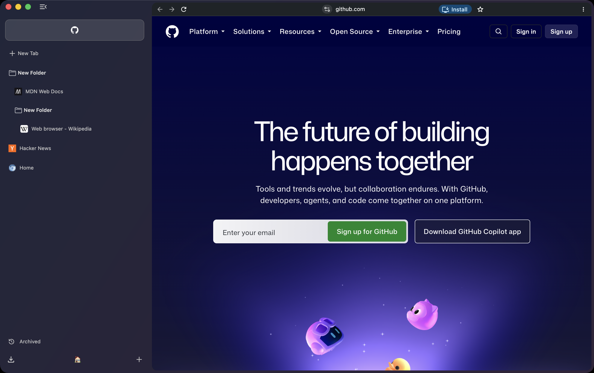
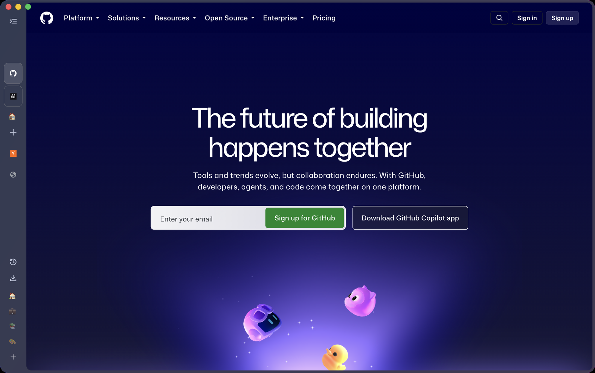
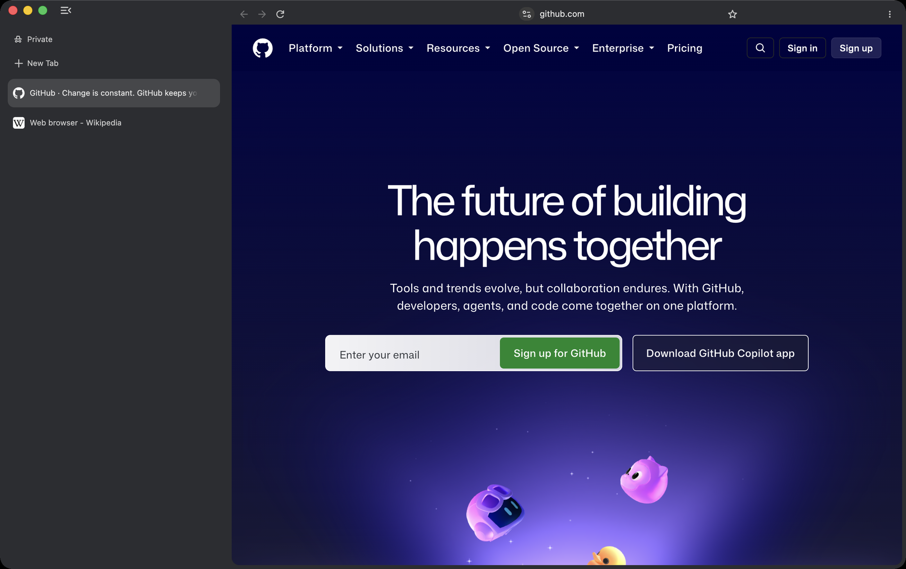
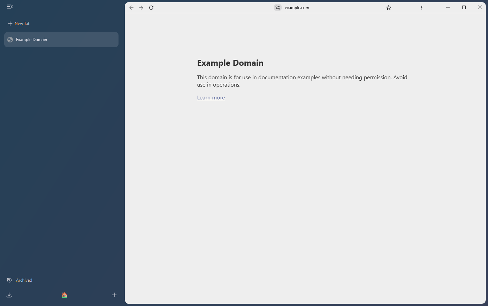
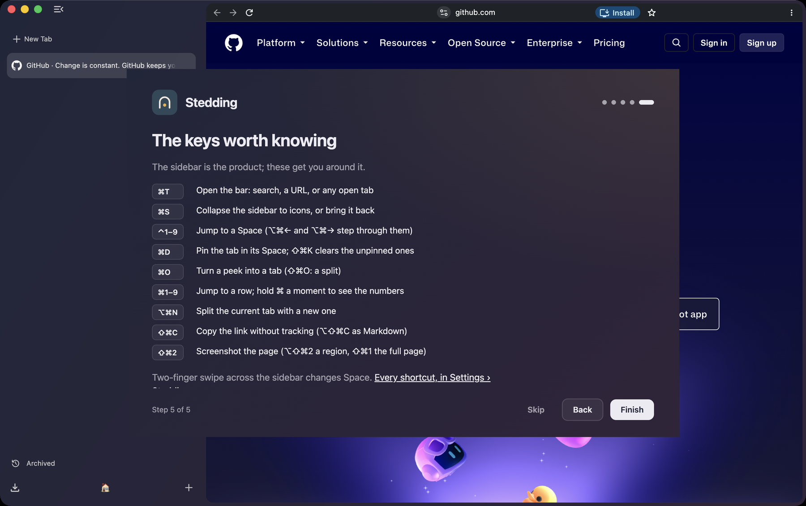
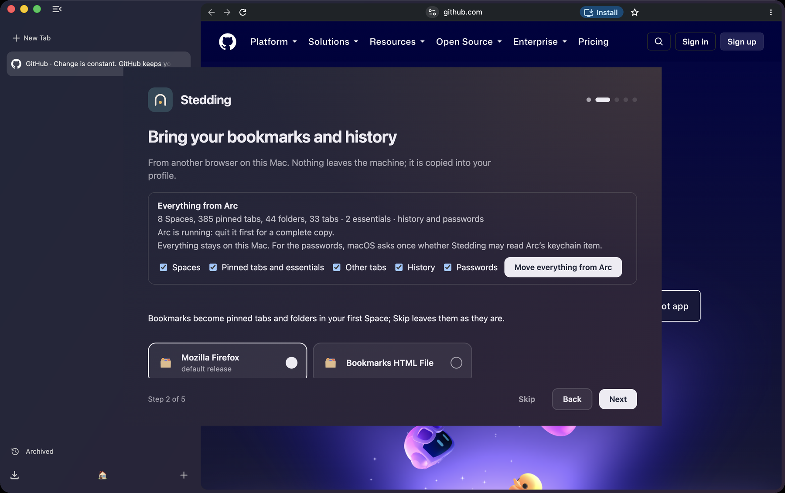

<p align="center">
  <picture>
    <source media="(prefers-color-scheme: dark)" srcset="branding/public/svg/logo-horizontal-dark.svg">
    
  </picture>
</p>

<h1 align="center">Stedding Browser</h1>

<p align="center">
  <b>An open-source, Arc-style web browser built on Chromium.</b><br>
  A sidebar with vertical tabs, Spaces, folders and pinned tabs, a command bar,
  and one-click import from Arc.<br>
  macOS (Apple silicon) and Windows. No telemetry. BSD-3-Clause.
</p>

<p align="center">
  <a href="https://github.com/ysalitrynskyi/stedding-browser/releases/latest"></a>
  <a href="LICENSE"></a>
  
  
</p>

<p align="center">
  <a href="#download">Download</a> ·
  <a href="#a-tour">Tour</a> ·
  <a href="#features">Features</a> ·
  <a href="#keyboard-shortcuts">Shortcuts</a> ·
  <a href="#moving-from-arc">Moving from Arc</a> ·
  <a href="#privacy">Privacy</a> ·
  <a href="#faq">FAQ</a> ·
  <a href="#building-from-source">Build</a> ·
  <a href="#documentation">Docs</a>
</p>



## What is Stedding?

Stedding is a desktop browser for people who liked the way Arc worked: tabs live in a
sidebar, each project or part of your life gets its own **Space**, the important sites
are **pinned** and always where you left them, and **⌘T** is one place to search,
open a site or jump to any tab. Arc stopped getting new features in 2025; Stedding
rebuilds that way of working on ground you control.

- **Open source, all of it.** The browser, its interface and the build are BSD-3-Clause
  licensed. No account, no company roadmap, nothing that can be taken away.
- **Built on Chromium stable** as a small, documented patch series, so it keeps up with
  Chromium's security releases and runs the extensions you already use.
- **Private by default.** No telemetry, no experiments, no Google sign-in or AI
  surfaces, tracker-blocking defaults switched on, DuckDuckGo as the search engine.
- **Made for technical users** who want a modern, keyboard-driven browser without
  trusting anyone's servers.

Every screenshot in this README is a capture of the current build, taken by the
project's own tooling; every claim below is backed by a test or a measured capture
(see [docs/features/](docs/features/)).

## Download

The current release is **0.2.0 beta 6**, built on Chromium 153 (stable). Get it from
the [Releases page](https://github.com/ysalitrynskyi/stedding-browser/releases/latest):

| Platform | File | Notes |
|---|---|---|
| macOS, Apple silicon (M1 or later) | `Stedding-<version>-arm64.dmg` | Open the DMG, drag **Stedding** to Applications, then **right-click → Open** the first time. |
| Windows 10 / 11, x64 | `Stedding-<version>-win-x64.exe` | Installs for the current user, no administrator prompt. If SmartScreen appears: **More info → Run anyway**, once. |

The builds are **not yet code-signed** (an Apple developer account exists; the
certificate and notarisation are the next step), which is why the first launch needs
that one extra click. A SHA-256 checksum for each file is in the release notes; the
[install guide](docs/INSTALL.md) shows how to verify it, where your data lives, and how
to update or uninstall.

Not available yet: Intel Macs and Linux. See [Status and roadmap](#status-and-roadmap).

## A tour

**Spaces.** Each Space is a set of tabs with its own colour, icon and pinned sites.
Switch with the chips at the bottom of the sidebar, with ⌃1–⌃9, or by swiping. A Space
you leave puts its tabs to sleep; sites can be routed so they always open in the right
Space.



**The command bar.** ⌘T opens one bar for everything: type a URL, a search, or the name
of any open tab in any Space and jump to it. Type `>` (or ⇧⌘P) for every command with
its shortcut.



**Folders and pinned tabs.** Drag tabs into folders, nest folders, collapse them, rename
anything in place. A pinned tab remembers its home page: wander away and a slash shows
it, click the favicon and you are back.



**The rail.** ⌘S collapses the sidebar to a column of icons and hides the address row;
hover to peek at it, or ⇧⌘D to show the address row on its own.



**Private windows** wear a different coat so you always know where you are.



**Windows.** The same browser on Windows, with the address row under the window's own
buttons and Arc's keyboard mapped to Ctrl and Alt.



## Features

**Sidebar and tabs**
- Vertical tabs at Arc's proportions: an essentials row above every Space, the Space's
  pinned sites, a Clear line, then the tabs. Three density presets and a text size.
- Rename a tab in place, select several and act on them together, hold ⌘ to number
  the first nine rows and jump with ⌘1–⌘9.
- Sleeping tabs: ⌘W puts a pinned tab to sleep instead of losing it; ⌃⇥ walks the
  Space's most recent tabs.
- Auto-archive: unpinned tabs nobody has looked at for 12 hours (a setting) move to an
  **Archived** view, searchable by day and Space, restorable with a click.
- Split view: ⌥⌘N splits the current tab with a new one; the panes move, pin and sleep
  together.

**Spaces**
- Per-Space tabs, colour and icon; a chip switcher with drag to reorder; keys for
  everything (⌃1–9, ⌥⌘←/→, ⌥⇧⌘←/→ to move a tab across).
- Routing: a site opens in the Space it belongs to, with a toast that undoes it.
- One sidebar for every window; ⌥⇧⌘N opens a blank window with Spaces of its own.

**Peek and little windows**
- A link that leaves a pinned site opens as a **peek** over the window instead of
  navigating the pin away. Escape dismisses it; ⌘O turns it into a tab, ⇧⌘O into a
  split.
- Links from other apps open in a small window of their own.

**The address row and the page**
- The page floats on a card; the address row is the top edge of the card in the page's
  own colour, with the address centred and no chrome around it.
- ⇧⌘C copies the link without tracking parameters, ⌥⇧⌘C as Markdown.
- Screenshots: ⇧⌘2 the visible page, ⌥⇧⌘2 a region, ⇧⌘1 the whole document; PNG to
  Downloads and the clipboard.

**Import, backups and export**
- Everything from Arc in one click (see [Moving from Arc](#moving-from-arc)).
- Bookmarks become pinned tabs and folders. Chromium's importer for Chrome, Firefox
  and Safari is on the same welcome step.
- Sidebar backups every hour, export a Space as a file, restore from a snapshot: the
  answer to sync without an account.

**Settings and shortcuts**
- A **Stedding** section first in Settings, one switch per feature, the window's
  Spaces to rename or delete, and the full shortcut reference.
- Chromium's Google and AI sections are gone; what remains is what the browser does.

**Extensions**
- It is Chromium: extensions install from the Chrome Web Store and work as they do in
  Chrome.

## Keyboard shortcuts

The most used ones. The complete list, for both platforms, is in
[docs/SHORTCUTS.md](docs/SHORTCUTS.md) and inside the browser at
**Settings → Stedding → Shortcuts**.

| Action | macOS | Windows |
|---|---|---|
| Command bar: search, a URL, any open tab | ⌘T | Ctrl+T |
| Every command with its shortcut | ⇧⌘P (or ⇥ in the empty bar) | Ctrl+Shift+P |
| Collapse or expand the sidebar | ⌘S | Ctrl+S |
| Show or hide the address row | ⇧⌘D | Ctrl+Shift+D |
| Pin the tab in its Space | ⌘D | Ctrl+D |
| Jump to Space 1–9 | ⌃1–⌃9 | Alt+1–9 |
| Next / previous Space | ⌥⌘→ / ⌥⌘← | Ctrl+Alt+→ / ← |
| Move the tab to the next / previous Space | ⌥⇧⌘→ / ⌥⇧⌘← | Ctrl+Alt+Shift+→ / ← |
| Jump to one of the first nine rows | ⌘1–⌘9 | Ctrl+1–9 |
| Most recent tab of the Space | ⌃⇥ | Ctrl+Tab |
| Clear the Space's unpinned tabs | ⇧⌘K | Ctrl+Shift+K |
| Split the tab with a new one | ⌥⌘N | Alt+Shift+N |
| Copy the link (clean) / as Markdown | ⇧⌘C / ⌥⇧⌘C | Ctrl+Shift+C / Ctrl+Alt+Shift+C |
| Screenshot: page / region / full page | ⇧⌘2 / ⌥⇧⌘2 / ⇧⌘1 | Ctrl+Shift+2 / Ctrl+Alt+Shift+2 / Ctrl+Shift+1 |
| New blank window (its own Spaces) | ⌥⇧⌘N | Ctrl+Alt+Shift+N |

Where Stedding rebinds a Chromium key, the old command keeps its menu item: Save Page
As is ⇧⌘S (Ctrl+Shift+S), the system print dialog on Windows is Ctrl+Alt+P.



## Moving from Arc

On the first start, the welcome flow offers **Move everything from Arc**: your Spaces
with their colours and icons, the essentials row, pinned tabs, folders (nested), open
tabs, browsing history and saved passwords. Each is a checkbox, all checked by default.

- Nothing leaves your machine: the importer reads Arc's own files on disk.
- Passwords need one macOS keychain prompt, because that is where Arc keeps its key.
- Imported tabs are created asleep, so a big sidebar costs nothing until you open one.
- You can run it again later from **Settings → Stedding → Import from Arc…** or from
  the command bar; a second run never duplicates what is already there.



Coming from Chrome, Firefox or Safari? The same step runs Chromium's importer, and
bookmarks become pinned tabs and folders in your first Space.

## Privacy

Privacy here is a set of defaults, not a mode. Out of the box:

- **No telemetry, no experiments.** No usage metrics, no crash reports, no unique
  identifiers, no field trials. The new tab page is local and makes no requests.
- **No Google account surfaces.** No sign-in, no Google services in the omnibox, no AI
  sections in Settings. DuckDuckGo is the default search engine; search suggestions
  are off until you turn them on.
- **Tracker-blocking defaults on:** third-party cookies blocked, HTTPS-first, Global
  Privacy Control sent, quiet permission prompts, Chromium's ad-measurement APIs off.
- **Private windows** in their own colours, with the same defaults.

Every network connection the browser makes is listed in
[docs/PRIVACY.md](docs/PRIVACY.md); anything not on that list is a bug we want to hear
about. Updates are not automatic yet: new versions appear on the Releases page.

## Status and roadmap

Stedding is a **beta**. The features above work and are tested, and the maintainer uses
it against Arc every day. What is out and what comes next:

| | State |
|---|---|
| macOS (Apple silicon) | Beta releases since 2026-09-01; the current one is beta 6 |
| Windows x64 | Preview installer since beta 5: the full interface, Arc's keys for Windows, a per-user install |
| Code signing and notarisation | Next: the Apple developer account exists; the Developer ID certificate follows (`S-17` in [BACKLOG.md](BACKLOG.md)) |
| Automatic updates | After signing; checks go to GitHub Releases, with no identifier (ADR 0014) |
| Windows: little windows, signing, updates | Open (`S-56`) |
| Linux | After Windows (milestone M9 in [docs/ROADMAP.md](docs/ROADMAP.md)) |
| Sync between machines | Not planned as a service; export, backup and restore files instead |

Known limits in the current builds: the first launch needs the right-click (unsigned);
⌃1–⌃9 collide with macOS Mission Control once you have a second desktop (the Spaces
menu keeps the commands reachable); a clipboard manager that owns ⇧⌘C system-wide
takes it before the browser does.

The full list of open work is [BACKLOG.md](BACKLOG.md); each feature's specification
and its tests are in [docs/features/](docs/features/). Release notes for every version
are in [docs/release-notes/](docs/release-notes/).

## FAQ

**Is it a fork of Arc?** No. Arc is closed source. Stedding is Chromium plus a series
of patches that add the sidebar, Spaces, the command bar and the rest, written from
scratch for this project.

**Why is it unsigned? Is it safe to open?** Signing needs an Apple Developer ID
certificate, which is being set up. Until then macOS shows a warning on the first
launch; right-click → Open gets past it once. Every build is made from the tagged
commit on this repository and its checksum is published beside it, so you can check
what you downloaded.

**Do my Chrome extensions work?** Yes. Stedding is Chromium; extensions install from
the Chrome Web Store as usual.

**Does it talk to Google?** Not for its own purposes. There is no telemetry, no
sign-in and no experiment downloads; the Web Store is contacted only when you install
or update an extension. The complete list of connections is in
[docs/PRIVACY.md](docs/PRIVACY.md).

**Where is my data?** In your profile folder, on your machine: on macOS under
`~/Library/Application Support/Stedding`, on Windows under `%LOCALAPPDATA%\Stedding`.
Sidebar backups are written there every hour; you can also export a Space as a file.

**Will it update itself?** Not yet. New versions appear on the Releases page; the
in-app updater lands with signing.

**Intel Mac? Linux?** Neither yet. Apple silicon and Windows x64 today; Linux is the
next platform after the Windows port is complete.

**What does "Stedding" mean?** A *stedding* is a place in Robert Jordan's Wheel of
Time where the One Power cannot reach — a haven. It is a metaphor for using the web
outside anyone's surveillance or control. Only the word is used; no artwork, marks or
affiliation are claimed ([docs/NAMING.md](docs/NAMING.md)).

More questions and answers: [docs/FAQ.md](docs/FAQ.md).

## Building from source

Stedding is a patch series on Chromium stable. Building needs a Mac with Apple silicon,
about 85 GB of disk for the checkout and one build, and a few hours the first time.

```bash
tooling/bootstrap-depot-tools     # once per machine
tooling/sync-chromium             # once per pin change; downloads tens of GB
tooling/apply-patches             # the Stedding patch series
tooling/apply-branding            # the name and the icon
tooling/build-chromium release
tooling/package-dmg release
```

The Windows build runs from the same series with `tooling/win/build.ps1` and
`tooling/win/package-installer.ps1`. Prerequisites, measured build times and the
failure modes already hit are in [docs/ARCHITECTURE.md](docs/ARCHITECTURE.md); how a
change goes from a spec row to a patch is [docs/AGENT-LOOP.md](docs/AGENT-LOOP.md).

## Contributing

Bug reports from real use are the most useful thing right now: install the latest beta,
use it for a day, and open an issue for each thing that is worse than what you use
today. Documentation fixes, design input and Chromium fork experience are welcome too.
See [CONTRIBUTING.md](CONTRIBUTING.md). Security issues go through GitHub's private
vulnerability reporting ([SECURITY.md](SECURITY.md)).

## Documentation

For users:

| Document | Contents |
|---|---|
| [docs/INSTALL.md](docs/INSTALL.md) | Installing on macOS and Windows, verifying the checksum, updating, uninstalling, where your data lives |
| [docs/SHORTCUTS.md](docs/SHORTCUTS.md) | Every keyboard shortcut, macOS and Windows |
| [docs/FAQ.md](docs/FAQ.md) | Questions and answers |
| [docs/PRIVACY.md](docs/PRIVACY.md) | The privacy principles and every network connection the browser makes |
| [docs/release-notes/](docs/release-notes/) | What each release changed, with checksums |

For the project:

| Document | Contents |
|---|---|
| [docs/VISION.md](docs/VISION.md) | Why this exists, values, explicit non-goals |
| [docs/ROADMAP.md](docs/ROADMAP.md) | Milestones from zero to 1.0 and where each stands |
| [docs/PRODUCT.md](docs/PRODUCT.md) | The full feature specification |
| [docs/COMPETITORS.md](docs/COMPETITORS.md) | Arc, Dia, Zen, Helium, Vivaldi, Brave, Thorium — and the gap Stedding fills |
| [docs/features/](docs/features/) | One specification per feature, each behaviour with its test: the definition of done |
| [docs/decisions/](docs/decisions/) | Architecture decision records |
| [BACKLOG.md](BACKLOG.md) | The one list of open work |

For contributors and AI agents: start with [AGENTS.md](AGENTS.md), then
[docs/HANDOFF.md](docs/HANDOFF.md) (the working loop, the dev parameters, the traps
already paid for) and [docs/ARCHITECTURE.md](docs/ARCHITECTURE.md). The index of
everything under `docs/` is [docs/README.md](docs/README.md).

## License

[BSD-3-Clause](LICENSE). Chromium is © The Chromium Authors, BSD-3-Clause.
