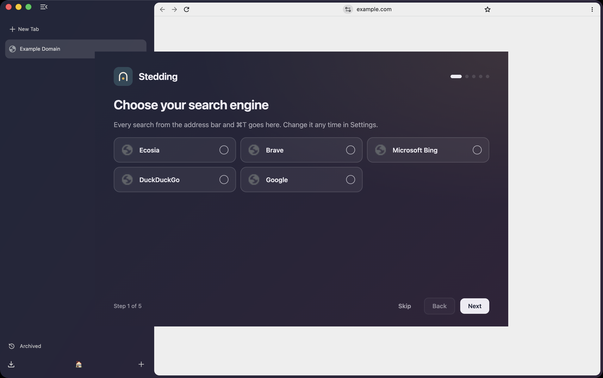

# Stedding Browser

A fully open-source, Chromium-based desktop browser with an Arc-style interface:
a sidebar with vertical tabs, Spaces, folders, pinned tabs with a home, and a
command bar. Built for people who want Arc's way of working on ground they control.


*Every screenshot here is a capture of the current build taken by the project's own
verification tooling (`tooling/capture-state`); every UI claim in these docs is checked
the same way, and the behaviours behind them have unit tests (`docs/features/`).*

## Why

Arc showed that a browser built around a sidebar, workspaces and keyboard-driven
navigation is a genuinely better way to work — and then its future was decided by a
VC-funded company's pivot. Stedding takes that workflow and rebuilds it on ground the
user controls: a minimal patch-set fork of Chromium stable, fully open source under
BSD-3-Clause, with full Chrome extension compatibility and no telemetry by default.
It is aimed at technical users who want privacy, control and a modern, productive UI
without trusting anyone's roadmap but their own.

A *stedding* is a haven where outside power cannot reach — the name is a metaphor for
using the web without surveillance or vendor control. See `docs/NAMING.md`.

## Status

**Beta 4 is out** — `v0.2.0-beta.4` on
[Releases](https://github.com/ysalitrynskyi/stedding-browser/releases), macOS
(Apple silicon), Chromium 153 stable, Stedding's patch series (`patches/`, 39 patches
on this commit). It is a beta: the feature set below works and is tested, and the
operator uses it against Arc daily. Beta 5 is prepared on this commit
(`docs/release-notes/v0.2.0-beta.5.md`) and is published from the Mac.

**Windows**: the series builds and runs on Windows x64 since 2026-09-08 — the
Stedding window, Spaces, folders, the command bar, the address row under the window's
own buttons (`docs/features/windows.md`, `docs/images/win-wide.png`). Not a release:
branding, the Windows keyboard map and an installer are M8 (`BACKLOG.md` S-56).

Builds are **unsigned until M7** (Apple's organisation enrolment is pending): open the
DMG, drag Stedding to Applications, then **right-click → Open** once. The release
notes carry the checksum. Windows and Linux come after macOS (`docs/ROADMAP.md`).

## What works today

- **The sidebar**, at Arc's proportions: an essentials row above every Space, the
  Space's title, its pinned run, a Clear line, then the tabs; 44 px rows, 18 px
  favicons, three density presets and a text size. ⌘S collapses it to a rail and
  hides the address row with it; ⇧⌘D brings the row back on its own.
- **Spaces**: per-window tab sets with a switcher at the bottom, a colour that tints
  the window, ⌃1–9 and ⌥⌘←/→ to move between them, drag a tab onto a chip, a chip
  drag to reorder, and one sidebar shared by every window (⌥⇧⌘N for a blank one).
  Sites can be routed to a Space; a Space you leave puts its tabs to sleep.
- **Pinned tabs with a home**: ⌘D pins in the Space; ⌘W puts a pin to sleep; a pin
  that wandered shows Arc's slash before its title and a click on the favicon takes it
  home. Links that leave a pinned site open as a **peek** over the window.
- **Folders** with nesting, collapse, rename in place, drag a tab onto a header.
- **The command bar** on ⌘T: open tabs across Spaces, archived tabs, history and
  search suggestions; ⇧⌘P (or a leading `>`) lists every command with its chord.
- **The page card**: the page floats on the window ground; the address row is the top
  of the card in the page's own colour, the address centred on the row with no chrome around it.
- **Tabs**: rename, ⌘-number badges, multi-select verbs, Stedding's short menus, sleep
  and wake, ⌃⇥ through the Space's recent tabs, splits that move as one row,
  auto-archive after 12 hours into an **Archived** view you can search and restore from.
- **Move everything from Arc in one click**: Spaces, essentials, pinned tabs, folders,
  tabs, history and passwords, from the welcome flow, settings or ⌘T (nothing leaves
  the machine; passwords need one macOS keychain prompt). Bookmarks become pins.
  Sidebar backups every hour; export a Space as a file.
- **Privacy defaults**: third-party cookies blocked, HTTPS first, Global Privacy
  Control, no Google sign-in or AI surfaces, DuckDuckGo default, search suggestions off
  until you turn them on, no telemetry. Private windows wear their own coat.
- **Screenshots** (⇧⌘2 page, ⌥⇧⌘2 region, ⇧⌘1 full page) to Downloads and the
  clipboard; **little windows** for links from other apps; a **welcome flow** for the
  first minute; **every shortcut** listed in chrome://settings/stedding.
- **Proprietary codecs** (H.264/AAC) verified decoding real frames.




The definition of done is `docs/features/<feature>.md`: one row per behaviour with its
test. `docs/ARC-ROUND2.md` is the ledger of what the operator found on real builds and
what changed; `docs/UI-SPEC.md` the measured Arc match; `BACKLOG.md` what is open.

## Building it

```bash
tooling/bootstrap-depot-tools     # once per machine
tooling/sync-chromium             # once per pin change; downloads tens of GB
tooling/apply-patches             # our patch series
tooling/apply-branding            # our name and icon
tooling/build-chromium release
tooling/package-dmg release
```

Day to day, `tooling/dev` is the loop: `build`, `test <feature>`, `capture`, `patch`,
`status`. `tooling/capture-state` photographs any browser state without touching the
keyboard or the pointer. Full prerequisites, measured build times and the failure modes
we actually hit are in [docs/ARCHITECTURE.md](docs/ARCHITECTURE.md); how a change goes
from spec to patch is [docs/AGENT-LOOP.md](docs/AGENT-LOOP.md). Following upstream is
`tooling/update-pin`, and a scheduled workflow opens an issue the day Chromium stable
moves ahead of our pin.

## Not there yet

- Signing and notarisation, and the in-app updater that needs them (M7, `S-17`).
- Windows as a release (M8, `S-56`: it builds and runs; no branding, keyboard map or
  installer yet) and Linux (M9).
- The gaps each feature spec names as `gap`, and the rows in `BACKLOG.md`.

## Principles

- **Open source, BSD-3-Clause.** The core browser is and stays permissively licensed.
  Closed or paid add-ons may exist later; the browser itself does not depend on them.
- **User control.** Your data, your defaults, your machine. No account required, no
  server-side dependency for core features.
- **No ads, no crypto, ever.** The browser will never bundle advertising, sponsored
  content or cryptocurrency features.
- **Ship polished or not at all.** Every milestone ends in something installable and
  usable. Features ship complete — shortcuts, settings, edge cases — or they wait.

## Technical direction

Minimal patch-set fork of Chromium stable (the Brave/Helium model, not a hard fork).
UI changes live as high in the stack as possible to keep rebases against upstream
cheap and routine. Target platforms in order: macOS, then Windows, then Linux.
Details in `docs/ARCHITECTURE.md`.

## Documentation

| Document | Contents |
|---|---|
| [AGENTS.md](AGENTS.md) | Canonical project context — start here |
| [docs/HANDOFF.md](docs/HANDOFF.md) | The working loop, every dev parameter, the traps already paid for |
| [docs/AGENT-LOOP.md](docs/AGENT-LOOP.md) | The procedure: research → spec → failing test → implement → build → test → capture → patch |
| [docs/features/](docs/features/) | One spec per feature: numbered behaviours, each with its test. The definition of done |
| [BACKLOG.md](BACKLOG.md) | The one list of open work, by id |
| [docs/ARC-ROUND2.md](docs/ARC-ROUND2.md) | Operator-feedback ledger from real builds, round by round |
| [docs/UI-SPEC.md](docs/UI-SPEC.md) | The measured Arc match, item by item |
| [docs/VISION.md](docs/VISION.md) | Why this exists, values, explicit non-goals |
| [docs/PRODUCT.md](docs/PRODUCT.md) | Full feature spec: sidebar, workspaces, split view, command bar, settings, import |
| [docs/ARCHITECTURE.md](docs/ARCHITECTURE.md) | Fork strategy, build system, patch management, updater, signing |
| [docs/ROADMAP.md](docs/ROADMAP.md) | Milestones M0 → 1.0 with acceptance criteria |
| [docs/QUALITY.md](docs/QUALITY.md) | The "ready-to-use" bar: performance budgets, release checklist |
| [docs/PRIVACY.md](docs/PRIVACY.md) | Privacy principles and concrete defaults |
| [docs/COMPETITORS.md](docs/COMPETITORS.md) | Arc, Dia, Zen, Helium, Vivaldi, Brave, Thorium — and our gap |
| [docs/NAMING.md](docs/NAMING.md) | The naming decision record |
| [docs/BRAND.md](docs/BRAND.md) | Name meaning, voice, taglines, trademark hygiene |
| [docs/IMPLEMENTATION.md](docs/IMPLEMENTATION.md) | How each feature is built, what upstream already provides, and what it costs |
| [docs/EVIDENCE.md](docs/EVIDENCE.md) | What Arc switchers actually ask for, with counts |
| [docs/ROUND6-PLAN.md](docs/ROUND6-PLAN.md) | Round 6, the Zen-mods review: the plan and how each part landed |
| [docs/decisions/](docs/decisions/) | Architecture decision records (ADRs) |
| [docs/release-notes/](docs/release-notes/) | What each release changed, with checksums |
| [tooling/README.md](tooling/README.md) | The build, capture and release scripts and how to use them |
| [branding/README.md](branding/README.md) | The mark, the palette, and how assets are generated |
| [CONTRIBUTING.md](CONTRIBUTING.md) | How to contribute |
| [SECURITY.md](SECURITY.md) | How to report vulnerabilities |

**For AI agents and new contributors:** start with [AGENTS.md](AGENTS.md), then
[docs/HANDOFF.md](docs/HANDOFF.md). They are kept current as decisions change.

## License

[BSD-3-Clause](LICENSE).
