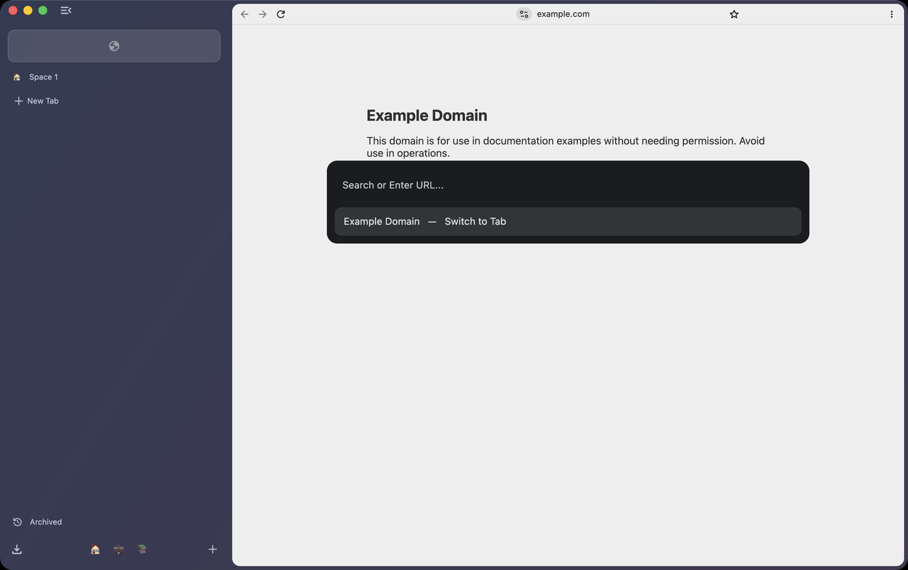
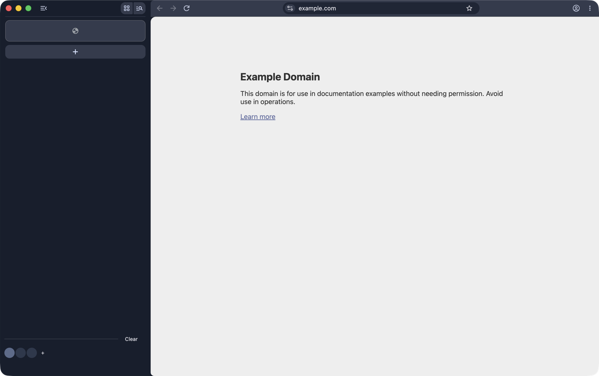
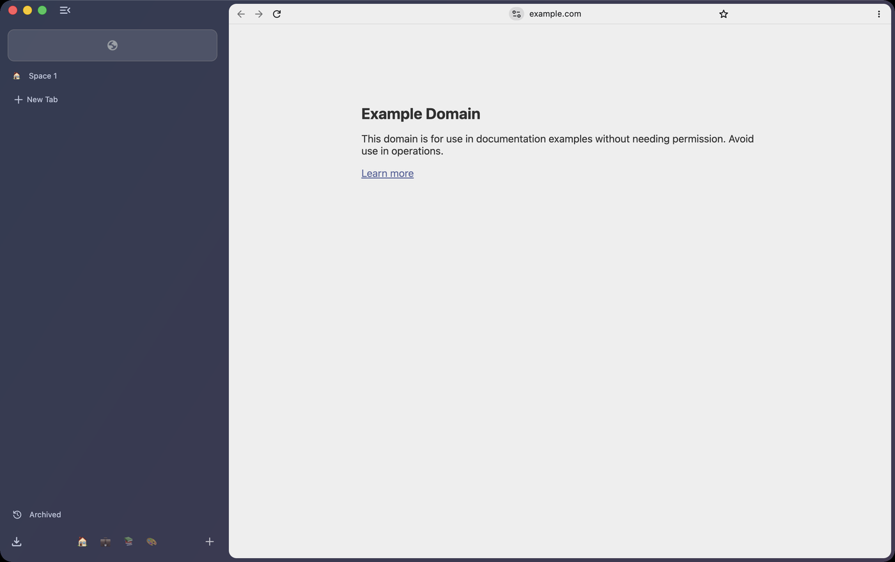

# UI specification — matching Arc

The target is a **pixel-accurate match of Arc's window chrome**, measured from
reference screenshots of Arc running on macOS. This document is the spec that
work is checked against; where it disagrees with a screenshot, the screenshot
wins and this file gets corrected.

Chromium's built-in vertical tab strip is *not* the target. It supplies the tab
model — see `decisions/0010-ride-upstream-vertical-tabs.md` — and almost none of
the appearance. Treating "vertical tabs are on" as "the sidebar is done" was an
early mistake in this project and is recorded here so it is not repeated.

## Layout, at a 2000×1293 reference window

Measurements are from the reference screenshot. They are ratios and radii, not
fixed pixel counts, except where a constant is genuinely constant.

```
┌──────────────────────────────────────────────────────────────┐
│                     window background (dark)                 │
│ ┌───────────┐  ┌──────────────────────────────────────────┐  │
│ │           │  │  toolbar strip — on the dark ground      │  │
│ │  sidebar  │  ├──────────────────────────────────────────┤  │
│ │           │  │                                          │  │
│ │           │  │  web contents — light, rounded top-left  │  │
│ │           │  │                                          │  │
│ └───────────┘  └──────────────────────────────────────────┘  │
└──────────────────────────────────────────────────────────────┘
```

| Element | Value |
|---|---|
| Sidebar width | ~352 px, user-resizable, persisted |
| Window top strip above contents | ~48 px |
| Toolbar row height | ~44 px, sitting on the window background |
| Contents corner radius | ~12 px, **top-left only** in the reference — contents meet the right and bottom window edges |
| Window background | dark slate, near `#1E2029`; the space's theme colour tints this |
| Contents background | the page's own; the browser draws no frame around it |

The single most important difference from stock Chromium: **the web contents do
not meet the top-left corner of the window.** They are inset below a toolbar
strip and rounded, so the window background reads as a mat around the page. That
one change accounts for most of "looks like Arc".

## Sidebar

Top to bottom. This order is corrected from a reference screenshot; an earlier
version of this file put the space switcher at the top, which is wrong.

| Element | Value |
|---|---|
| **Essentials** | A grid of large rounded cards at the very top, ~150x50, radius ~12. These are pinned tabs that live **above all Spaces** — they are visible whichever Space is active. Icon only, no label |
| Space-pinned tabs | Below the essentials: ordinary rows, favicon plus label, pinned **within the current Space** |
| Divider | 1 px hairline with a `Clear` at its right end, which closes this Space's tabs and leaves the essentials. **Done** (patch 0024) |
| `New Tab` row | Plus glyph plus label, muted, **above** the unpinned tabs |
| Tab row height | ~48 px |
| Favicon | ~18 px, left inset ~28 px |
| Active tab | Filled rounded rect, radius ~10, inset ~10 from the sidebar edges |
| **Space switcher** | At the **bottom**, not the top: a row of small icons, ~24 px, one per Space, with a trailing `+`. Hovering one raises a pill showing that Space's name |
| Space identity | Each Space has a name **and an icon**, both user-set. Hovering an icon raises its name above the row |

The two things this project got wrong first time, recorded so they are not
repeated: the essentials row is not the same thing as pinned tabs (essentials
are global, pinned tabs are per-Space), and the Space switcher is at the bottom
of the sidebar, shown as icons rather than named pills.

## Toolbar

Thin — noticeably thinner than Chromium's. Back, forward and reload at the left.
The URL is **centred** and shows the bare host with a small link glyph.
Extension and plugin icons are in the **top right**, on the same row.

No omnibox chrome: no pill background, no border.

## Command bar




⌘T opens a centred overlay, not a focused omnibox: a dark rounded panel with
`Search or Enter URL...` and a result list beneath it.

The results are the important part. They mix:

- open tabs in the current Space, actioned as `Switch to Tab`
- tabs in **other** Spaces, labelled with the name of the Space they are in
- ordinary suggestions and search

So the command bar searches across every Space, which is why `TabStripModel`
holding all Spaces' tabs (ADR 0015) is the right shape rather than a limitation.

## How this gets checked

Screenshot the built browser at the reference window size, put it beside the Arc
reference, and compare. Differences are logged here as they are fixed. "Looks
close" is not a check — the comparison image goes in the pull request.

## Where it stands



With four Spaces and a pinned essential (`--features
'SteddingArcStyleWindow:extra_spaces/3/pin_tabs/1'`):



Captured with `tooling/capture-ui` at 1400x880. Numbers below are measured from
that image, not estimated.

## Tuning these numbers costs nothing

The contents corner radius, the tab row height and the tab pill radius are
feature parameters, not constants, so a value can be tried against a build that
already exists:

```
tooling/capture-ui --features \
  'SteddingArcStyleWindow:contents_corner_radius/16/vertical_tab_height/48'
```

Change a number, capture, measure, repeat — no compile, no link. Defaults are
the shipping values in the table below. See patch 0007.

## Progress

Measured against the table above, not against "looks closer".

| Item | State |
|---|---|
| Contents corner nearest the tab strip | Done — 12 px, `SteddingBrowserViewLayout`, measured at 12 pt in the capture |
| Sidebar width | Done — 352 px, measured in the capture |
| Tab row height | Done — 44 px, measured in the capture (Chromium's default is 30) |
| Active tab pill radius | Done — 10 px |
| Favicon size | **Deliberately not done.** 16 px, not 18. `gfx::kFaviconSize` is global and the image would not scale with the slot |
| Bare-host URL | Done — unfocused only; the full URL returns on focus. Verified in the capture |
| Sign-in promo pill | Removed — Chromium advertises Google sign-in in the toolbar by default |
| Command bar (⌘T) | **Done** — centred overlay, searches every Space and names the Space a result is in, opens URLs and searches (patches 0016-0017) |
| Centred URL | **Done** — capped by a flex rule, spacers either side; measured centre 890 against a content centre of 876 (patch 0015) |
| Space switcher | **Done** — a row of icons at the **bottom** of the sidebar, active one full strength, plus a button that makes a new Space (patches 0011, 0013). The first attempt put named pills at the top, which was wrong |
| Essentials row | **Done** — pinned tabs are exempt from the Space filter, so they sit above all Spaces, and their tiles are 50 DIP tall so they read as cards (patch 0014) |
| Window background tinted per space | **Done** — `Widget::SetUserColorOverride` from the active Space's colour, and the colour is settable from the Space's context menu (patch 0025). A window with one Space is left untinted |

## Still not the reference

Every item in the tables above is built. What a side-by-side still shows:

- The toolbar is 39 DIP, down from Chromium's 46. It does not go lower by these
  constants; something else floors it there.
- Favicons are 16 DIP where the reference has 18, on purpose: `gfx::kFaviconSize`
  is global and the image would not scale with the slot.

## Pinned tabs cannot be seeded for a screenshot

Writing `pinned_tabs` into a throwaway profile's `Preferences`, which is the
pref `PinnedTabCodec` reads at startup, does not work: Chromium's
tracked-preference protection rejects a value it did not write itself and the
key comes back empty. That is the anti-tampering feature doing its job, and not
something to work around.

The way round it is a parameter on our own code — `pin_tabs` — which pins the
first N tabs once the window has them. That defeats nothing; it is the same
trade as `extra_spaces` and the tunable metrics.

## The centred URL was deferred, wrongly

This file previously argued the centred URL was not worth doing: it needed
spacers around the location bar, `InitLayout()` is private and non-virtual so no
subclass could reach it, and `toolbar_view.cc` takes 205 commits a year.

The premise was right and the conclusion was wrong. It is not a rewrite of the
layout: it is a flex rule on a child that is already there, plus two empty
views. Recorded because the reasoning -- "this file is expensive, therefore do
not touch it" -- is worth applying to the size of the change rather than to the
file.

## Known gaps

The sidebar's top area still holds Chromium's collapse button and the tab-group
and tab-search combo buttons, where Arc has the space switcher. The toolbar is
still Chromium's, left-aligned, with the omnibox pill. There is no favorites
grid and no bottom app-icon row.

The space switcher is deliberately not built yet. A row of pills that changes an
active id without moving any tabs would be a picture of a feature, and this
project ships features complete or not at all — see the mandate in AGENTS.md.
It lands with the tab-parking work, not before.
